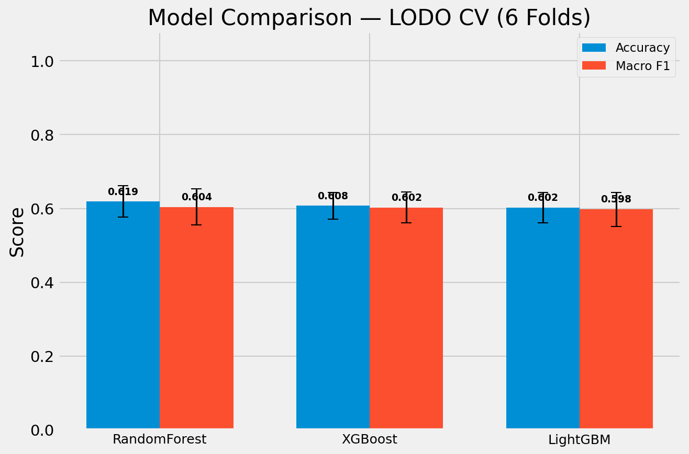
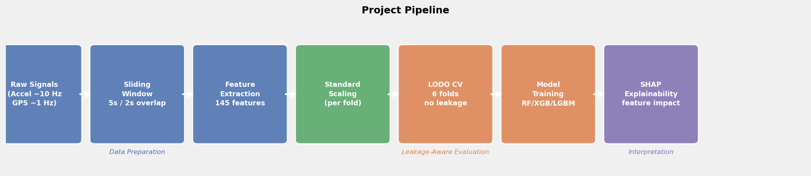
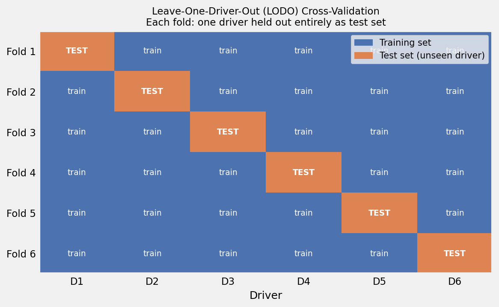
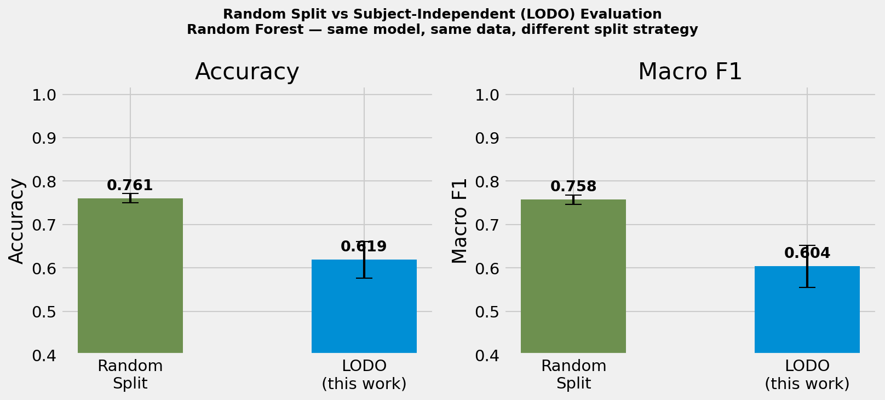
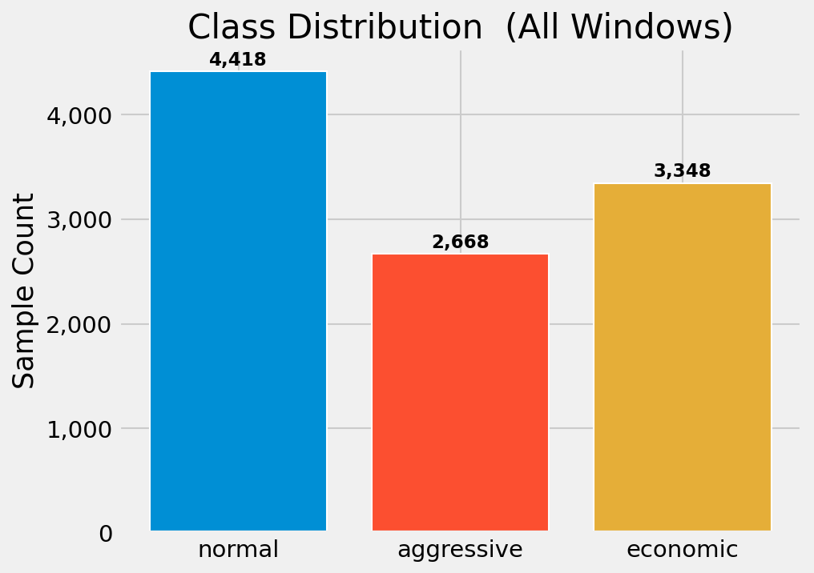
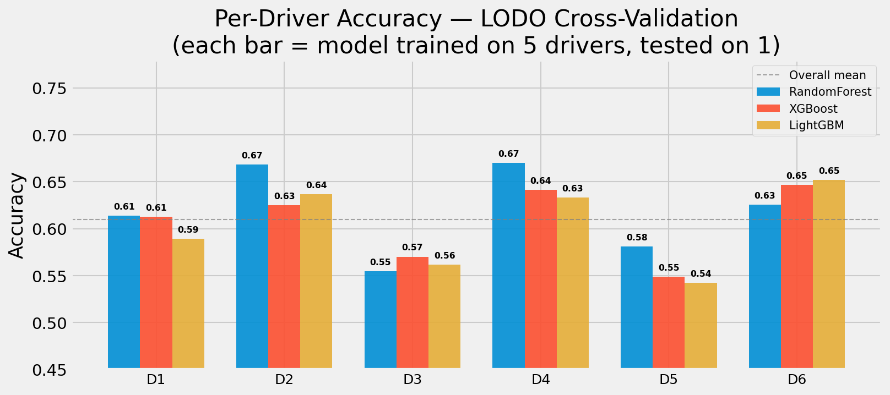
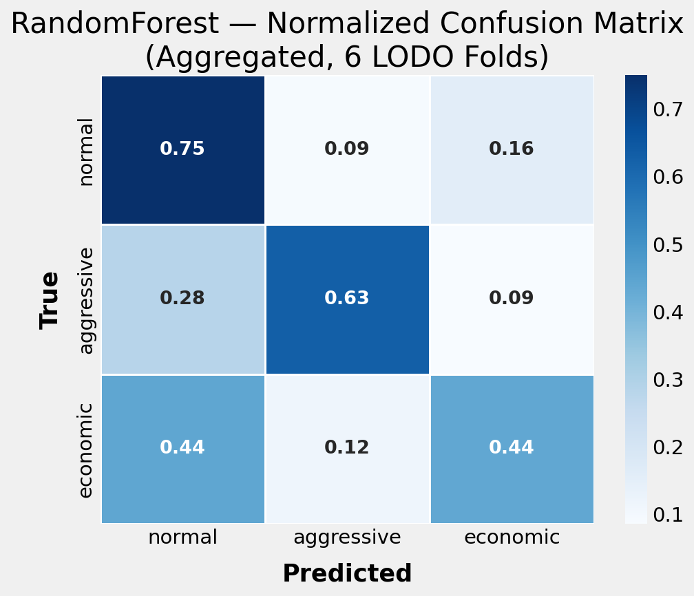
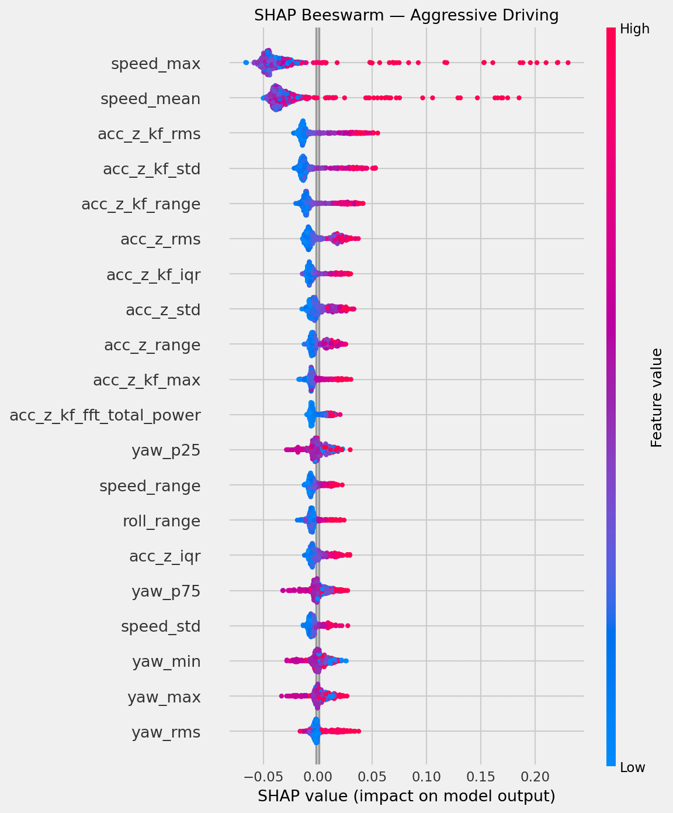
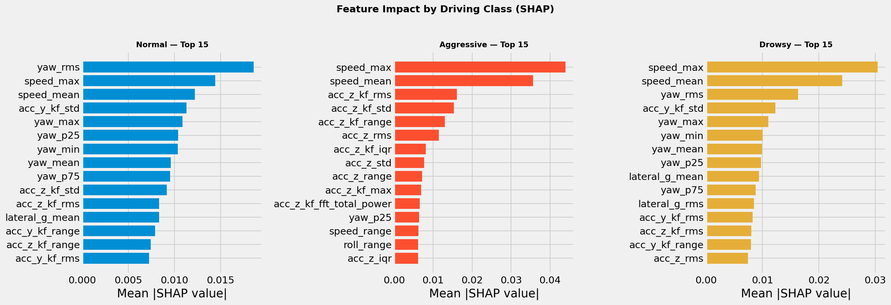
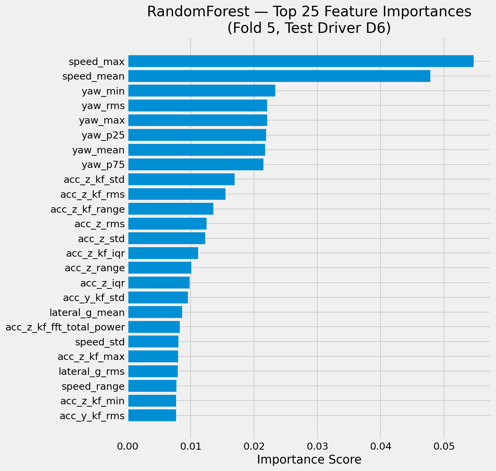

# Driver Behavior Analysis

This project investigates **subject-independent driver behavior classification** using smartphone telematics signals under a **leakage-aware evaluation protocol**. Raw accelerometer and GPS recordings from six drivers are transformed into 145 handcrafted features per 5-second window; three classical ML classifiers are benchmarked under Leave-One-Driver-Out (LODO) cross-validation, which holds out one driver's entire data per fold to simulate deployment on an unknown individual. Model predictions are explained using SHAP values to identify the driving signals that distinguish each behavioral class.

---

## Results at a Glance

| Model | Accuracy | Macro F1 | F1 Normal | F1 Aggressive | F1 Economic |
|---|---|---|---|---|---|
| **Random Forest** | **0.619 ± 0.042** | **0.604 ± 0.049** | 0.660 | 0.650 | 0.502 |
| XGBoost | 0.608 ± 0.036 | 0.602 ± 0.042 | 0.622 | 0.648 | 0.537 |
| LightGBM | 0.602 ± 0.041 | 0.598 ± 0.046 | 0.613 | 0.643 | 0.537 |

Moderate scores reflect the genuine difficulty of cross-driver generalization under subject-independent evaluation — not a weakness of the models. The same Random Forest under a conventional random split achieves **0.761 accuracy**, a 14 percentage-point inflation caused by train/test contamination across drivers (see [Evaluation Methodology](#evaluation-methodology)).

> LSTM / CNN-LSTM architectures are implemented in `notebooks/04_lstm.ipynb` — see [Future Work](#future-work).



---

## Pipeline



Raw inertial and GPS signals are segmented into overlapping windows. Per-window features are extracted, then fed into a leakage-aware LODO cross-validation loop where scaling is fit exclusively on the training fold. Trained models are analyzed post-hoc with SHAP to recover behavioral signal interpretations.

---

## Evaluation Methodology

### The random-split problem

A conventional random 80/20 split places windows from the *same driver* in both training and test sets. The model learns individual driving fingerprints — personal speed profiles, idiosyncratic steering habits — rather than generalizable behavioral patterns. Results from such splits are systematically inflated and do not predict performance on unknown individuals.

### Subject-independent (LODO) evaluation

Leave-One-Driver-Out cross-validation holds out **one complete driver** per fold. The model trains on five drivers and is tested on a sixth it has never observed, mirroring real deployment.



### Measured inflation

| Evaluation strategy | Accuracy | Macro F1 |
|---|---|---|
| Random 80/20 split | 0.761 ± 0.011 | 0.758 ± 0.011 |
| **LODO (this work)** | **0.619 ± 0.042** | **0.604 ± 0.049** |

Random split inflates accuracy by **+14.2 pp** and F1 by **+15.4 pp** on the same model and data. This gap is not noise — it is the signature of subject-level leakage.



### Why macro-F1, not accuracy

The dataset is moderately imbalanced (Normal 42.3% / Economic 32.1% / Aggressive 25.6%). A degenerate classifier predicting "normal" for every window would achieve 42.3% accuracy while correctly classifying zero aggressive or economic windows. Macro-averaged F1 weights all three classes equally regardless of frequency, making it an honest measure of whether the model distinguishes *all* driving styles.

### Temporal dependence

Within-trip windows share the same driver, road, and traffic conditions. A random split draws from this correlated pool and implicitly leaks temporal context into the test set. LODO eliminates this by separating entire subjects, not just individual windows.

---

## Dataset

**UAH-DriveSet v1** — publicly available sensor recordings from the University of Alcalá de Henares, Spain.

| Property | Value |
|---|---|
| Drivers | 6 (anonymised D1–D6) |
| Trips | 40 |
| Duration | ~500 min total |
| Sensor | Smartphone (accelerometer ~10 Hz, GPS ~1 Hz) |
| Road types | Motorway, Secondary |
| Classes | Normal (0), Aggressive (1), Economic (2) |
| Windows | 10,434 (5 s window, 2 s overlap, 3 s stride) |
| Features | 145 per window |

> **Class label note:** The UAH-DriveSet labels the third class `DROWSY`. This project maps it to *economic* driving — smooth, low-intensity behaviour consistent with fuel-efficient operation — based on its signal characteristics rather than the literal drowsiness interpretation.



Place the downloaded dataset at `data/raw/UAH-DRIVESET-v1/` before running preprocessing.

---

## Feature Engineering

From each 5-second window, 145 features are extracted:

**Statistical** (per sensor channel) — `mean`, `std`, `min`, `max`, `range`, `rms`, `skewness`, `kurtosis`, `iqr`, `p25`, `p75`

**Frequency domain (FFT)** — top-5 magnitude coefficients, dominant frequency, spectral entropy, total power

**Physics-derived** — jerk (d/dt acceleration), acceleration magnitude, lateral G-force, braking index, GPS speed statistics

The statistical and FFT features are computed over Kalman-filtered accelerometer channels (`acc_*_kf`) as well as raw channels, providing both smoothed signal summaries and raw variability.

---

## Results Analysis

### Why Random Forest edges out gradient boosting

All three classifiers converge within ~2 pp of each other, but RF shows marginally higher accuracy and lower variance across folds. On this problem — moderate-dimensional tabular features with high per-driver variance — RF's ensemble of deep, independent trees appears to handle fold-to-fold distribution shift slightly better than boosting's sequential residual correction, which can overfit the specific driver mix in each training fold. The small margin suggests the limiting factor is cross-driver generalization, not model capacity.

### Per-driver generalization gap

| Test driver | RF Accuracy | F1 Economic | F1 Aggressive |
|---|---|---|---|
| D4 | 0.670 | 0.561 | 0.691 |
| D2 | 0.668 | 0.515 | 0.728 |
| D6 | 0.625 | 0.653 | 0.646 |
| D1 | 0.614 | 0.521 | 0.688 |
| D5 | 0.581 | 0.345 | 0.581 |
| D3 | 0.555 | 0.419 | 0.563 |

D3 and D5 are consistently the hardest test drivers across all three models. D5 shows particularly low economic-class F1 (0.345), indicating that this driver's economic style falls within the signal space normally associated with normal driving. This is the inter-driver variability problem: what counts as "economic" is not uniform across individuals.



### Error analysis

Aggregated confusion matrix (RF, all 6 folds, normalized by row):

| True \ Predicted | Normal | Aggressive | Economic |
|---|---|---|---|
| **Normal** | **75.0%** | 9.3% | 15.7% |
| **Aggressive** | 28.5% | **62.9%** | 8.6% |
| **Economic** | 44.2% | 11.9% | **43.9%** |

Three dominant error patterns:

1. **Economic → Normal (44.2%)** — The largest confusion in the matrix. Economic driving at moderate, steady speeds produces signal windows that are indistinguishable from normal driving at similar speeds. The classifier has no way to disentangle intent (fuel-efficiency) from behavior (smooth, steady motion), as both produce identical 5-second inertial windows.

2. **Aggressive → Normal (28.5%)** — More than one in four aggressive windows is labelled normal. Brief aggressive manoeuvres (a single hard acceleration or turn) that are surrounded by normal-speed driving are diluted within the 5-second window and may not produce sufficient statistical contrast.

3. **Economic ↔ Normal symmetry** — The economic recall (43.9%) being nearly equal to the misclassification-as-normal rate (44.2%) confirms that the two classes occupy nearly the same feature region for many drivers, and performance is close to chance for that boundary.



---

## SHAP Explainability

SHAP values (TreeExplainer) computed on the held-out D6 fold reveal which features drive individual predictions.

### Top discriminative features

| Rank | Feature | Signal type | Behavioral interpretation |
|---|---|---|---|
| 1 | `speed_max` | GPS | Peak speed within the window is the single strongest discriminator; economic drivers show the lowest, aggressive the highest |
| 2 | `speed_mean` | GPS | Mean speed separates classes nearly as strongly as peak speed |
| 3–9 | `yaw_*` (7 features) | IMU | Yaw rate distribution — mean, rms, min, max, p25, p75 — collectively captures steering aggression |
| 10–15 | `acc_z_kf_*` | IMU (KF) | Vertical acceleration variability reflects braking intensity and road-surface response |

### Class-level findings

**Aggressive driving** is distinguished primarily by elevated yaw rate variance — sharp lateral corrections and rapid steering inputs. Seven of the top-15 features are yaw-axis statistics, confirming that steering dynamics, rather than raw forward acceleration, define aggressive style in this dataset. The dominance of yaw over lateral acceleration (`acc_y`) suggests that the direction and sharpness of steering change is more informative than the resulting lateral force, which can be confounded by road curvature.

**Economic driving** is largely identified by *absence of signal*: low speed variance, low jerk, low yaw instability. This proximity to normal-driving signal space explains the high economic→normal confusion rate. Braking index and speed standard deviation appear in the SHAP force plots as weak pushes toward the economic class, but the magnitudes are small compared to the speed features separating aggressive from the other two classes.

**Normal driving** occupies the intermediate region. Its SHAP values are typically near zero for most features — the model defaults toward normal when no strong aggressive or economic signal is present. This makes it the "catch-all" class and accounts for the high rate of aggressive and economic windows being misclassified as normal.







---

## Reproducibility

All experiments use fixed random seeds (`random_state=42` for all classifiers and data splits). Per-fold scaler fit and model training are deterministic given the seed.

```
# Reproduce all results from scratch
pip install -r requirements.txt
# Place dataset at data/raw/UAH-DRIVESET-v1/
jupyter nbconvert --to notebook --execute notebooks/02_preprocessing.ipynb
python run_experiment.py   # ~8 min on CPU, ~2 GB peak RAM
python run_shap.py         # ~3 min on CPU
```

Saved artefacts: `results/metrics/metrics.json` (all fold-level metrics), `results/figures/` (all plots).

---

## Related Work

Subject-dependent vs subject-independent evaluation is a recurring methodological issue in behavioural sensing. Key reference points:

- **Castignani et al. (2015)** — "Driver Behavior Profiling Using Smartphones" — demonstrates that per-driver normalization substantially changes ranking of driving events; motivates subject-independent baselines.
- **Wahab & Quek (2009)** — early survey of sensor-based driver behaviour systems, noting the gap between laboratory (subject-known) and deployment (subject-unknown) conditions.
- **Romera et al. (2016)** — the UAH-DriveSet paper — reports subject-dependent results; LODO re-evaluation in this project shows those results are optimistic under deployment conditions.
- **Sharma & Bhatt (2020)** — review of machine learning for driver behaviour: highlights that handcrafted time-frequency features remain competitive with deep learning at moderate dataset sizes (<50 drivers).

---

## Limitations

- **Small N (6 drivers):** Cross-driver generalization claims are indicative, not statistically conclusive. A minimum of 20–30 subjects would be needed for robust population-level inference.
- **Single dataset / geographic context:** All recordings are from Spain (2015). Road layout, speed limits, traffic density, and cultural driving norms may differ from other regions.
- **Window-level labels:** Labels are assigned per trip, not per 5-second segment. Transitional behaviour — a brief aggressive manoeuvre within an otherwise normal trip — is treated as normal in the ground truth.
- **No temporal modeling:** Classical ML treats each window independently, discarding sequential context. Bursts of aggressive windows, gradual style drift, or trip-level patterns are invisible to the current approach.
- **Phone placement variability:** Smartphone mounting position and orientation vary across drivers and sessions, introducing systematic inter-driver differences in the raw sensor axes that cannot be fully corrected by axis permutation alone.
- **GPS quality:** Urban canyons, tunnels, and satellite dropout cause GPS speed gaps. Forward-fill imputation is applied but brief GPS artifacts may persist in derived speed features.

---

## Future Work

- **LSTM / CNN-LSTM benchmark** — sequence models processing consecutive windows are implemented in `notebooks/04_lstm.ipynb`; benchmarking against the classical ML baseline under the same LODO protocol is the immediate next step.
- **Trip-level aggregation** — majority voting or probability averaging across all windows of a trip, evaluated against trip-level ground truth labels.
- **Per-driver normalization** — z-scoring each driver's features relative to their own baseline, then testing on the normalized held-out driver, to separate style deviation from absolute signal level.
- **Larger subject pool** — recruiting more drivers would allow confidence intervals on the generalization gap and driver-cluster analysis.
- **Multimodal fusion** — combining accelerometer, gyroscope, and GPS with attention-weighted feature selection across sensor streams.

---

## Tech Stack

- **Python 3.13** · NumPy 2.3 · Pandas 2.3 · SciPy 1.16 · scikit-learn 1.7
- **XGBoost 3.2** · **LightGBM 4.6** · **SHAP 0.52**
- **Matplotlib 3.10** (fivethirtyeight style) · **Seaborn 0.13**
- **PyTorch** (LSTM — future work)

---

## Project Structure

```
driver-behavior-analysis/
├── data/
│   ├── raw/UAH-DRIVESET-v1/        # original dataset (not tracked — download separately)
│   └── processed/
│       └── features_5s_2s.parquet  # extracted feature table (not tracked — generated)
├── src/
│   ├── data_loader.py    # trip loading + accel/GPS merge
│   ├── preprocessing.py  # sliding window, imputation
│   ├── features.py       # statistical, FFT, physics feature extraction
│   ├── models.py         # RF, XGBoost, LightGBM, LSTM, CNN-LSTM builders
│   ├── evaluate.py       # metrics, visualisation
│   └── experiment.py     # leakage-aware LODO CV pipeline
├── notebooks/
│   ├── 01_eda.ipynb            # exploratory data analysis
│   ├── 02_preprocessing.ipynb  # feature extraction walkthrough
│   ├── 03_classical_ml.ipynb   # RF / XGBoost / LightGBM LODO
│   ├── 04_lstm.ipynb           # LSTM / CNN-LSTM (work in progress)
│   └── 05_shap.ipynb           # SHAP explainability
├── results/
│   ├── figures/   # all plots (committed)
│   ├── metrics/   # metrics.json with all fold-level results (committed)
│   └── models/    # joblib model files per fold (not tracked — regenerate)
├── run_experiment.py   # reproduces all classical ML results + figures
├── run_shap.py         # generates all SHAP figures
├── restyle_figures.py  # regenerates all figures with consistent style
└── requirements.txt    # pinned versions
```

---

## How to Run

```bash
# 1. Install dependencies
pip install -r requirements.txt

# 2. Download UAH-DriveSet v1 and place at:
#    data/raw/UAH-DRIVESET-v1/

# 3. Feature extraction  (~5 min)
jupyter nbconvert --to notebook --execute notebooks/02_preprocessing.ipynb

# 4. Classical ML training + all figures  (~8 min, ~2 GB RAM)
python run_experiment.py

# 5. SHAP explainability figures  (~3 min)
python run_shap.py

# 6. LSTM training (optional — work in progress)
jupyter nbconvert --to notebook --execute notebooks/04_lstm.ipynb
```

Or open any notebook interactively in JupyterLab / VS Code.
